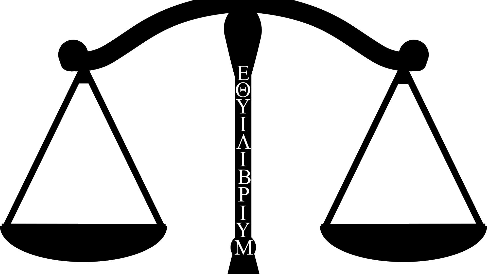

#Equilibrium
###The puzzle game within the browser!

Equilibrium is a puzzle game where you combine two elements to create a new material.

Completely worked into the [Huge](https://github.com/panique/huge) framework made by [panique](https://github.com/panique) with our own Javascript worked into it.

This game includes a way to store your progress within the database via means of logging in.

###This game includes:
 - 500+ Elements
 - Latest Javascript techniques
 - A rulebook and tutorial

 ###Credits
 This game was made by Ben Kemp and Vincent Schaddelee.
 The project was started on the 23rd of May, 2016.
 Front-end programming by: Vincent Schaddelee.
 Back-end Programming by: Ben Kemp.